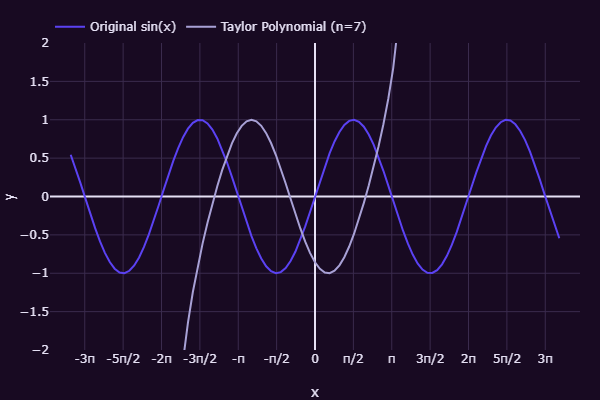

# Taylor Series Visualizer

An interactive and educational tool to visualize Taylor series approximations for mathematical functions like $sin(x)$, $cos(x)$, and $e^x$, with a modern, responsive interface.

- **Modern dark theme** with vibrant mathematical visualizations
- **Interactive graphing**: Real-time updates as you adjust the number of terms or center point
- **Responsive design**: Seamless experience on desktop and mobile with a sleek, mathematical aesthetic

[Taylor Series Visualizer](https://diegoaybar.github.io/taylor-series-visualizer/public/)

## Features
- Visualize Taylor polynomial approximations for $sin(x)$, $cos(x)$, and $e^x$
- Adjust the number of terms $n$ and center point $a$ with intuitive sliders
- Rectangular graph with $pi:1$ grid for trigonometric functions and 1:1 grid for $e^x$
- LaTeX-rendered polynomials and formulas for clear mathematical display
- Optimized JavaScript for fast graph rendering using Plotly.js and WebAssembly
- Detailed explanations of Taylor series, their derivation, and applications in physics and engineering
- Mobile-responsive layout with Bootstrap 5 for a polished, user-friendly experience

## Technologies
- **HTML/CSS/JavaScript**: Core web technologies
- **Bootstrap 5**: Responsive UI framework
- **Plotly.js**: Interactive graphing
- **KaTeX**: LaTeX rendering for mathematical expressions
- **Math.js**: Function evaluation
- **WebAssembly**: Fast Taylor series calculations

Built with HTML, CSS, JavaScript, WebAssembly, Plotly.js, KaTeX, and Bootstrap by [Diego Aybar](https://github.com/diegoaybar)